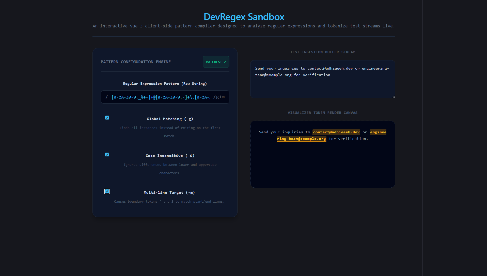

#  DevRegex — Real-Time Regular Expression Sandbox & Visual Match Matrix (Vue.js)
----------------------------------------------------------------------------------------

DevRegex is an interactive client-side regular expression studio engineered using modern Vue.js v3 composition rules. It compiles raw user-input string tracks directly into native RegExp structures inside runtime validation loops, using computed state mechanics (`computed`) to capture match sets and safely inject token highlights without risking cross-site script rendering injections.

## Preview
---------------------------------------------------------------------------------------

##  Technical Highlights Tested
-------------------------------------------------------------------------------------------

*  **Reactive State Compilations:** Uses unified computed variable blocks to re-evaluate structural code evaluations only when patterns or text matrices alter.
*  **Defensive Try/Catch Paradigms:** Intercepts regex syntax errors during character generation loops, piping structural formatting faults straight down onto isolated error HUD panels without halting thread operations.

##  Running Instructions

1. Install dependencies: `npm install`
2. Run development compiler: `npm run dev`
